# Rosint+

**Reddit user intelligence tool**: search any Reddit user's full post and comment history, including private accounts, removed comments, and deleted content.

[rosintplus.github.io](https://rosintplus.github.io/)

This is a fork of **[rosint.dev](https://rosint.dev)** extended with profile analytics, saved profiles, themes, localization, and more.

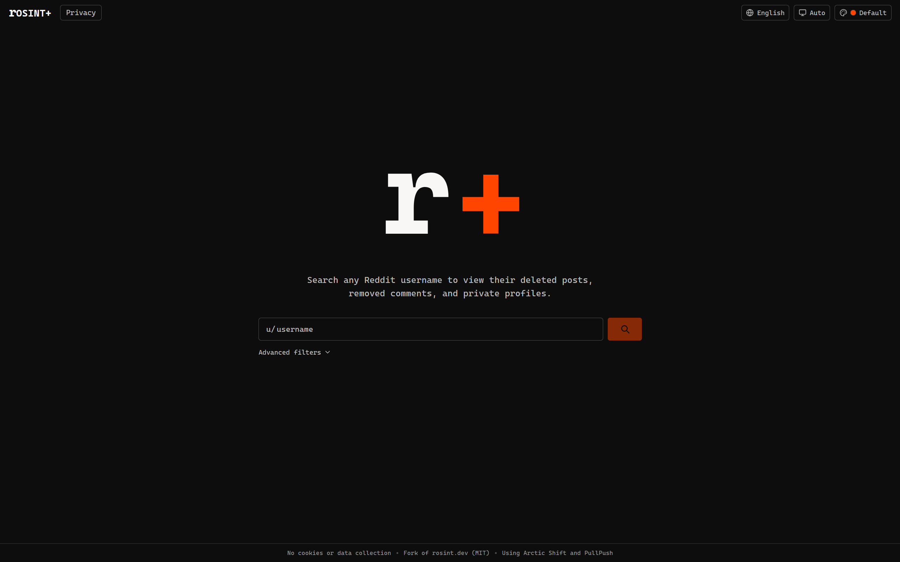
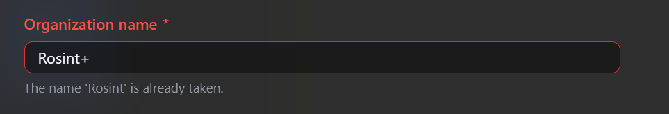
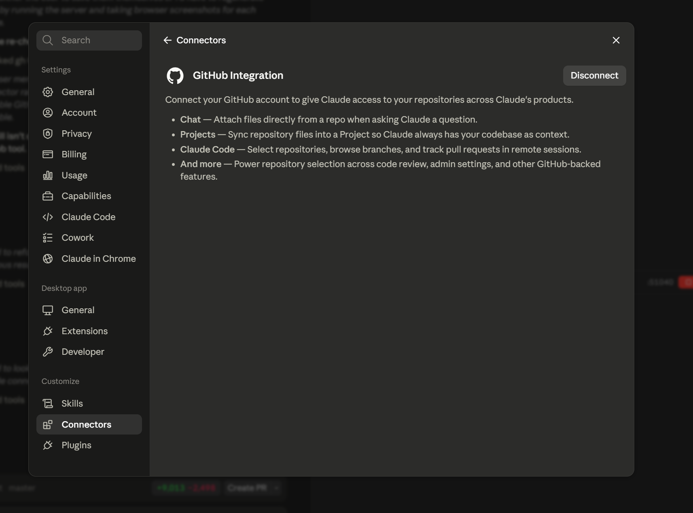

## Features

- **Dual-source search** > Arctic Shift and PullPush queried in parallel, results merged and deduplicated by post/comment ID
- **Posts tab** > title, subreddit, score, comment count, timestamp, thumbnail, body snippet
- **Comments tab** > full comment body, subreddit, score, link to original thread
- **Date range filter** > filter results by before/after date using a calendar picker
- **Pagination** > timestamp-based cursor pagination (100 results per page)
- **No login required** > fully frontend, no backend, no auth

### Added in this fork

- **Profile analytics** - a stats panel with top subreddits, an activity heatmap (with an estimated timezone), and most-common words
- **Saved profiles** - pin profiles to disk (IndexedDB), plus recent-search history

- **9 color themes** - Default, Nord, Catppuccin, Cyber, Mono, Gruvbox, Dracula, Solarized, and Synthwave - each with light / dark / auto modes (see [Themes](#themes))
- **6 languages** - English, Espanol, Francais, Deutsch, Japanese, and Chinese
- **Export** - download the current result set as CSV or JSON
- **Copy permalink** - one click copies the permalink, timestamp, and details
- **Keyboard accessible** - visible focus rings, escape-to-close menus, and a skip-to-content link

## Themes

Nine built-in themes, each with light, dark, and auto (system) modes.

| | |
|---|---|
| 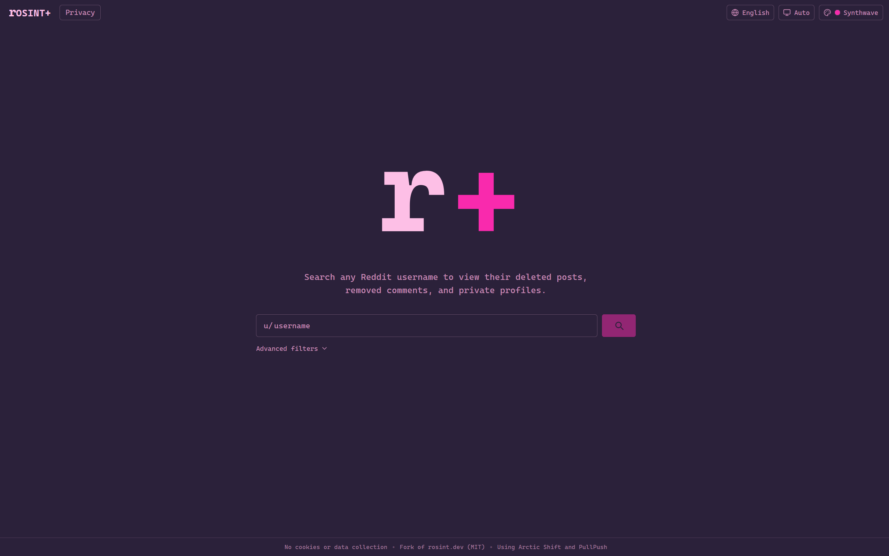 Nord | 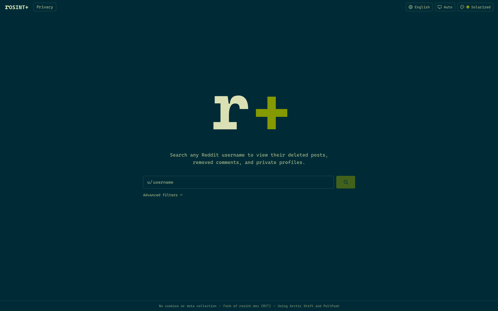 Catppuccin |
| 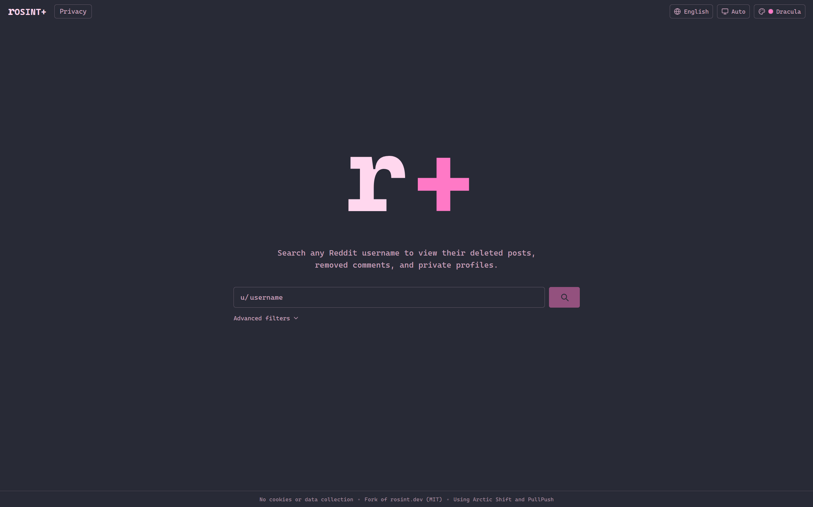 Cyber | 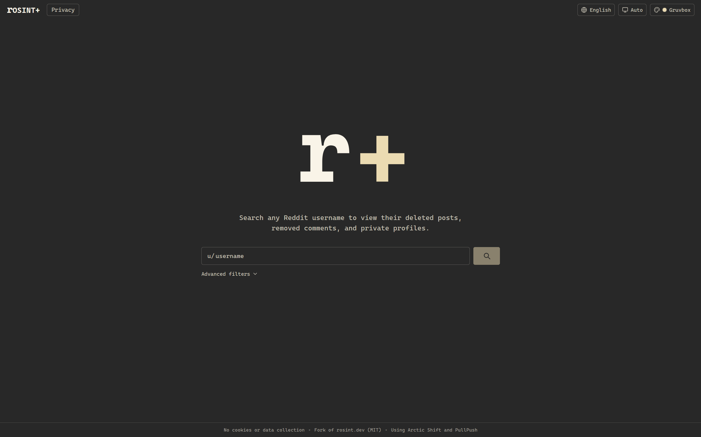 Mono |
| 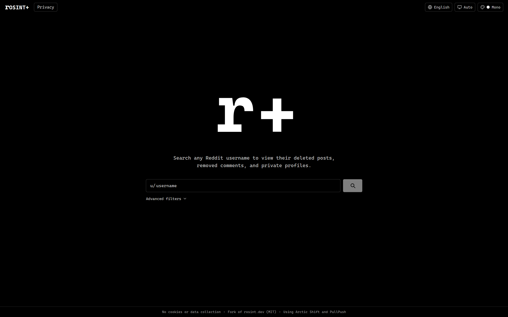 Gruvbox | 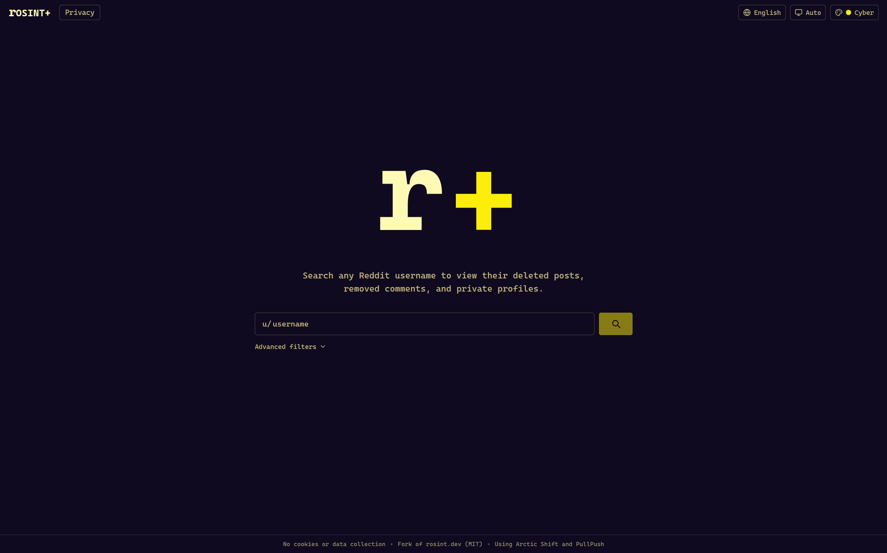 Dracula |
| 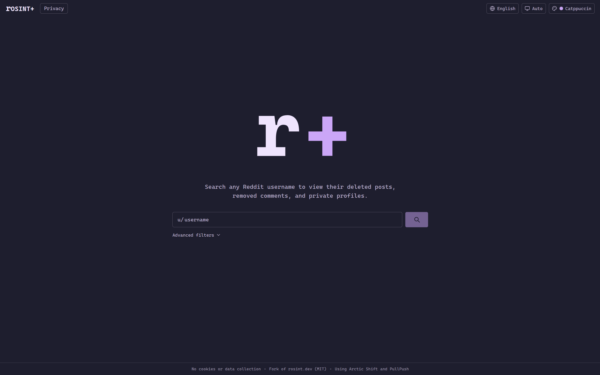 Solarized | 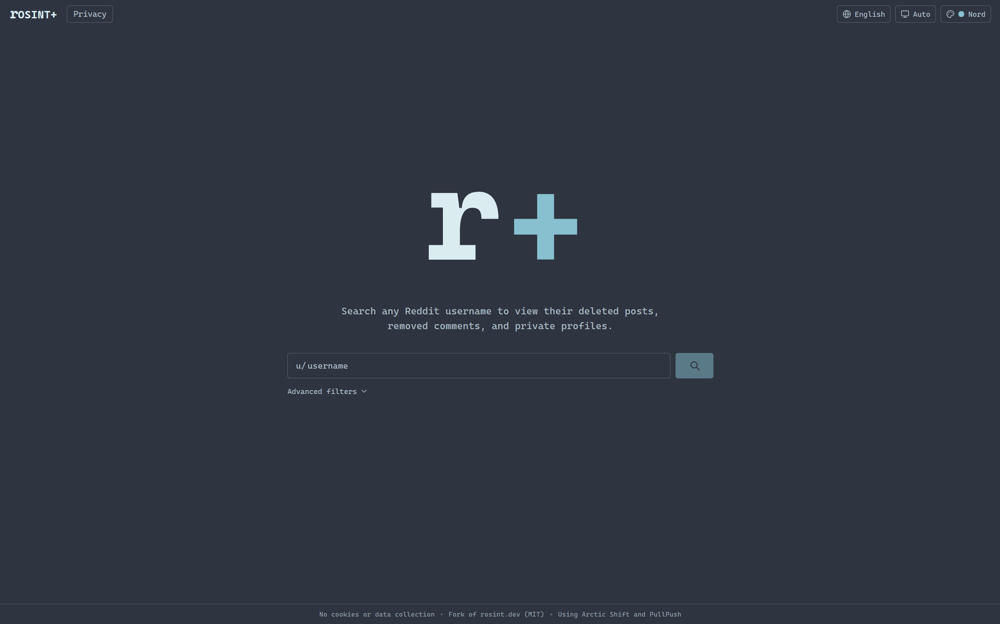 Synthwave |

## Running locally

```bash
git clone https://github.com/rosintplus/rosintplus.github.io.git
cd rosintplus.github.io
npm install
npm run dev
```

Then open [http://localhost:5173](http://localhost:5173).

## Backend

Both APIs are queried with the same parameters:

```
Arctic Shift:  https://arctic-shift.photon-reddit.com/api/posts/search?author={username}&limit=100&sort=desc
PullPush:      https://api.pullpush.io/reddit/search/submission/?test&author={username}&limit=100&sort=desc
```

## Limitations

- Archive data may not capture all recent posts
- Arctic Shift and PullPush have no guaranteed uptime
- If both APIs are down, no results will be returned

## Credits

- **[rosint.dev](https://rosint.dev)** - the original project this fork is based on
- [Arctic Shift](https://github.com/ArthurHeitmann/arctic_shift) by ArthurHeitmann
- [PullPush](https://pullpush.io)
